# cosmic

[](https://studio2201.com) [](https://github.com/idlescreen/cosmic/actions/workflows/snip.yml) [](https://github.com/idlescreen/cosmic/actions/workflows/vigil.yml) [](https://github.com/idlescreen/cosmic/actions/workflows/aegis.yml) [](https://github.com/idlescreen/cosmic/actions/workflows/proven.yml) [](https://github.com/idlescreen/cosmic/actions/workflows/boneyard.yml)

COSMIC panel applet for the IdleScreen daemon — applet state, quick
actions, daemon handshake. Part of
[IdleScreen](https://idlescreen.github.io) — modular Wayland screensavers
for Linux.

## Install

```sh
idlescreen install cosmic
```

Then add it from COSMIC Settings → Panel → Applets. (`idlescreen cosmic`
execs the `idlescreen-applet` binary, which only runs inside
cosmic-panel — for daemon status from a shell use `idlescreen status`.)

## License

Apache-2.0 · © 2026 IdleScreen

---

<div align="center">

[](https://necrometer.dev/?u=idlescreen)

</div>
